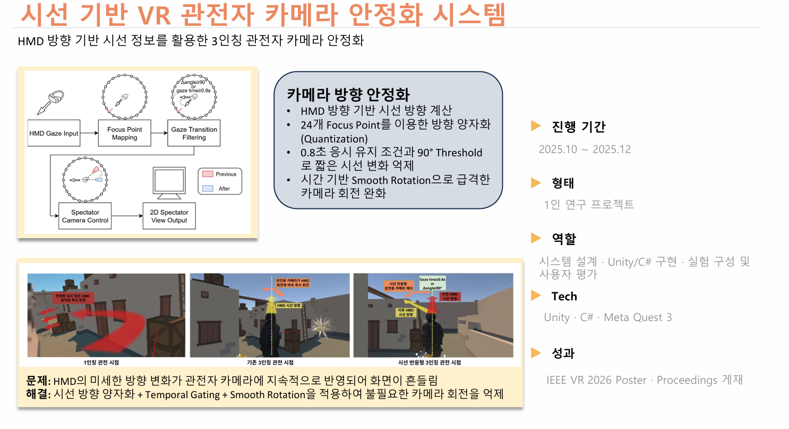

# Gaze-Based VR Spectator Camera Stabilization

## HMD Direction-Based Third-Person Spectator Camera Stabilization

HMD의 미세한 방향 변화가 관전자 카메라에 지속적으로 반영되어  
화면이 불필요하게 흔들리는 문제를 줄이기 위해 개발한  
3인칭 VR 관전자 카메라 안정화 시스템입니다.

  

---

## Project Overview

**Period**  
2025.10 ~ 2025.12

**Type**  
1인 연구 프로젝트

**Role**  
시스템 설계 · Unity/C# 구현 · 실험 구성 및 사용자 평가

**Tech Stack**  
Unity · C# · Meta Quest 3 · Meta XR / Oculus SDK · Unity XR

**Result**  
IEEE VR 2026 Poster / Proceedings 게재

---

## Problem

VR HMD에서는 사용자가 의도적으로 고개를 돌리지 않더라도  
미세한 방향 변화가 지속적으로 발생합니다.

이 값을 관전자 Camera에 직접 반영하면  
Camera가 작은 움직임에도 계속 회전하여  
2D 관전자 화면에 불필요한 흔들림이 발생했습니다.

---

## Approach

### Gaze Direction Quantization

HMD Forward 방향을 기준으로 사용자의 시선 방향을 계산하고,  
주변을 24개의 Focus Point로 나누어 방향을 Quantization했습니다.

### Temporal Gating

작은 시선 변화는 바로 Camera에 반영하지 않고,  
동일한 방향이 약 0.8초간 유지된 경우에만 Camera 방향을 변경했습니다.

### Large Direction Change Handling

큰 방향 변화는 별도의 Threshold를 사용하여  
일반적인 미세 움직임과 다르게 처리했습니다.

### Smooth Rotation

새로운 Camera 방향이 확정되면  
즉시 회전시키는 대신 시간 기반 Rotation을 적용하여  
급격한 Camera 움직임을 완화했습니다.

### Position / Yaw Stabilization

Camera Pivot의 Position과 Yaw에 Low-Pass Filtering을 적용하여  
HMD와 Avatar의 작은 움직임이 Camera에 직접 전달되는 것을 줄였습니다.

---

## Main Source Files

### `CenterViewpoint.cs`

HMD 방향을 24개의 Focus Point에 Mapping하고,  
Temporal Gating과 Threshold를 이용해 Camera 방향 전환을 결정합니다.

또한 목표 방향으로 Camera를 Smooth Rotation시키고  
최종 위치에 가까워지면 Snap하여 미세한 움직임을 줄입니다.

### `StablePivot.cs`

Position과 Yaw 값에 시간 기반 Low-Pass Filtering을 적용하여  
Camera Pivot을 안정화합니다.

### `PositionOnlyPivot.cs`

HMD의 로컬 위치 변화에서 Camera에 불필요한 성분을 제거하고  
Position 정보만 부드럽게 추종합니다.

### `SpectatorXRDetach.cs`

Spectator Camera가 XR Tracking에 의해 자동으로 제어되지 않도록 분리하고  
일반 Display 출력용 Camera로 사용할 수 있도록 설정합니다.

### `FirstPersonSpectatorView.cs`

비교 실험을 위한 First-Person Spectator View의 기본 Camera 추종을 처리합니다.

---

## Repository Scope

This directory contains selected source code written for portfolio review.

Third-party SDKs, Unity Asset Store assets, models, scenes, prefabs, and other external resources are excluded.

The source files are provided for implementation review and are not intended to function as a standalone Unity project.