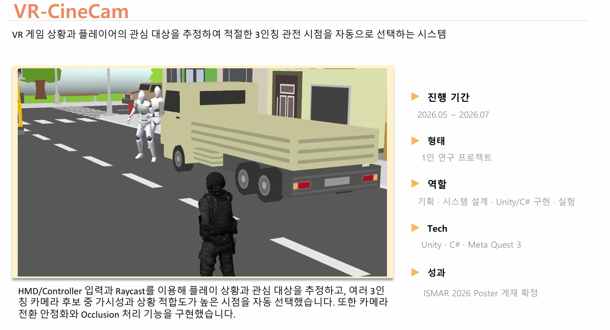
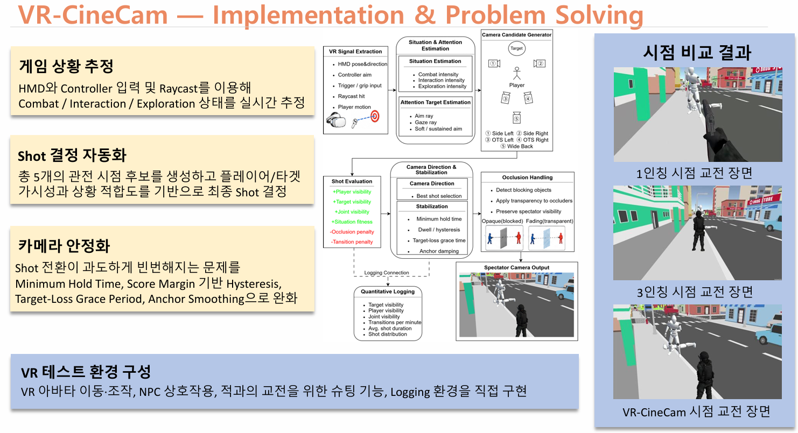

# VR-CineCam

## Intent-Aware Automatic Spectator Camera for VR Gameplay

VR 게임을 2D 화면으로 시청하는 관전자가 플레이 상황과 행동 의도를 쉽게 이해할 수 있도록,  
플레이어의 행동 맥락과 관심 대상을 추정하여 적절한 3인칭 관전 시점을 자동으로 선택하는 시스템입니다.

  

---

## Project Overview

**Period**  
2026.05 ~ 2026.07

**Type**  
1인 연구 프로젝트

**Role**  
기획 · 시스템 설계 · Unity/C# 구현 · 실험

**Tech Stack**  
Unity · C# · Meta Quest 3 · Meta XR / Oculus SDK · Cinemachine

**Result**  
ISMAR 2026 Poster 게재 확정

---

## Implementation & Problem Solving

  

### Situation Estimation

HMD와 Controller 입력 및 Raycast를 이용하여  
현재 플레이 상황을 다음 세 가지 상태로 추정합니다.

- Combat
- Interaction
- Exploration

### Attention Target Estimation

HMD 및 Controller 방향과 입력 정보를 이용하여  
플레이어가 현재 관심을 두고 있는 대상을 추정합니다.

Aim, Gaze, Soft / Sustained Aim과 Confidence를 함께 사용하고,  
Dwell Time과 Minimum Hold를 통해 급격한 Target 변경을 억제했습니다.

### Camera Candidate Generation

플레이어와 Attention Target의 상대 위치 및 현재 상황을 바탕으로  
여러 개의 3인칭 관전 시점 후보를 생성합니다.

### Shot Evaluation

각 Camera Candidate를 다음 기준으로 평가합니다.

- Player Visibility
- Target Visibility
- Joint Visibility
- Occlusion
- Proximity
- Situation Fitness
- Transition Penalty

### Camera Transition Stabilization

Shot 전환이 과도하게 빈번하게 발생하는 문제를 줄이기 위해 다음 로직을 적용했습니다.

- Minimum Hold Time
- Score Margin 기반 Hysteresis
- Target Loss Grace Period
- Target Reacquisition
- Anchor Smoothing
- Camera Blend Lock

### Occlusion Handling

관전자 Camera와 피사체 사이에 오브젝트가 존재할 경우  
해당 오브젝트를 Spectator Camera에서만 투명하게 처리하여 가시성을 유지합니다.

---

## Main Source Files

### `SignalExtractor.cs`
HMD와 Controller로부터 카메라 판단에 필요한 VR 입력 신호를 추출합니다.

### `SituationEstimator.cs`
Combat / Interaction / Exploration 상태를 계산합니다.

### `AttentionTargetEstimator.cs`
플레이어의 Aim / Gaze 정보를 이용해 현재 관심 대상을 추정합니다.

### `CameraCandidateGenerator.cs`
상황과 Target 관계를 바탕으로 Camera Shot 후보를 생성합니다.

### `ShotEvaluator.cs`
가시성, 상황 적합도, Occlusion 등의 요소를 이용해 Shot을 평가합니다.

### `CameraDirector.cs`
가장 적합한 Shot을 선택하고 Camera 전환을 안정화합니다.

### `CameraAnchorUpdater.cs`
카메라 Anchor의 급격한 이동을 완화합니다.

### `TargetGroupUpdater.cs`
Cinemachine Target Group 변경에 따른 FOV 및 구도 변화를 완화합니다.

### `OcclusionTransparencyHandler.cs`
Spectator Camera 시야를 가리는 오브젝트를 투명하게 처리합니다.

### `VCamPhysicsPassthrough.cs`
Virtual Camera 제어에 필요한 물리 정보를 전달합니다.

---

## Repository Scope

This directory contains selected core source code written for VR-CineCam.

Third-party SDKs, external assets, scenes, prefabs, models, sounds, and other resources are not included.

The source files are provided for implementation review and are not intended to function as a standalone Unity project.