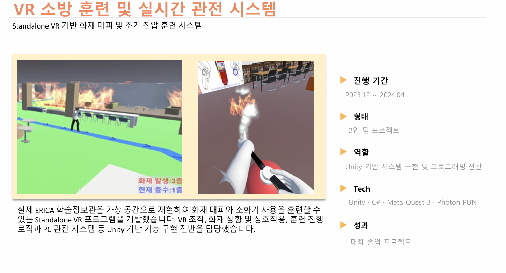
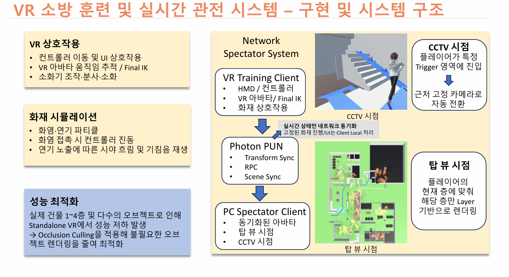

# VR Fire Training & Real-Time Spectator System

## Standalone VR Fire Evacuation and Initial Fire Suppression Training

실제 ERICA 학술정보관을 가상 공간으로 재현하여  
화재 대피와 소화기 사용을 훈련할 수 있도록 개발한 Standalone VR 프로젝트입니다.

VR 이동 및 상호작용, 화재·연기 상태 처리, 소화기 조작,  
Photon PUN 기반 PC 실시간 관전 시스템을 구현했습니다.

  

---

## Project Overview

**Period**  
2023.12 ~ 2024.04

**Type**  
2인 팀 대학 졸업 프로젝트

**Role**  
Unity 기반 시스템 구현 및 프로그래밍 전반

**Tech Stack**  
Unity · C# · Meta Quest 3 · Photon PUN · Unity XR

---

## Main Features

### VR Interaction

- Controller 기반 VR 이동
- VR Avatar 움직임 추적
- 소화기 잡기 및 단계별 조작
- Controller Haptic Feedback

### Fire & Smoke Simulation

- 화염 / 연기 Particle
- 화염 접촉 시 사용자 상태 변화
- 연기 노출량에 따른 시야 흐림
- 연기 단계에 따른 기침음 변화
- Particle 기반 화재 진압

### Performance Optimization

실제 건물 1~4층과 다수의 오브젝트를 포함하면서  
Standalone VR에서 Rendering 성능 저하가 발생했습니다.

Occlusion Culling을 적용하여  
현재 시점에서 불필요한 오브젝트 Rendering을 줄였습니다.

---

## Network Spectator System

  

VR Training Client와 PC Spectator Client를 Photon PUN으로 연결하여  
VR 사용자의 상태를 PC 관전자에게 전달했습니다.

### Photon PUN

- Room Connection
- Player Join / Leave
- Transform Sync
- RPC
- Scene Sync

### PC Spectator Client

- VR / Non-VR 실행 환경 구분
- Top View Camera
- CCTV Camera
- Trigger 기반 CCTV Camera 자동 전환
- 플레이어의 현재 층에 따른 Layer Rendering

고정된 화재 진행이나 UI처럼 네트워크 동기화가 필요하지 않은 요소는  
각 Client에서 Local로 처리하도록 구성했습니다.

---

## Main Source Files

### `VRMove.cs`
VR Player 이동과 45° Snap Turn을 처리합니다.

### `PlayerState.cs`
화재 및 연기 노출 정도에 따른 플레이어 상태를 관리합니다.

### `TouchingFire.cs`
Particle Collision 기반 화염 접촉 판정과 방향별 Controller 진동을 처리합니다.

### `BreathSmoke.cs`
연기 Particle 충돌과 연기 노출량을 관리합니다.

### `ExtinguisherUse.cs`
소화기 사용 과정의 상태를 관리합니다.

### `PinRemove.cs`
안전핀 제거 및 Controller Haptic Feedback을 처리합니다.

### `HandleUse.cs`
소화기 Handle Interaction을 처리합니다.

### `NozzleHandle.cs`
Nozzle Interaction과 분사 준비 상태를 관리합니다.

### `PlayExtinguisher.cs`
Photon RPC를 이용해 소화기 Particle Effect를 모든 Client에서 재생합니다.

### `ExtinguishFire.cs`
분사 Particle과 화염의 상호작용을 이용해 화염 크기를 감소시킵니다.

### `PhotonLauncher1.cs`
Photon 연결, Room 참가, Player 입퇴장 및 Scene Sync를 처리합니다.

### `CameraFilter1.cs`
플레이어의 현재 층에 맞춰 Camera Culling Mask와 위치를 변경합니다.

### `NonVRPlayer.cs`
VR / Non-VR 실행 환경을 구분하고 PC Spectator Camera를 구성합니다.

### `CctvFireLayerChange.cs`
CCTV 관전용 화재 오브젝트 Layer를 변경하고 복원합니다.

---

## Repository Scope

This directory contains selected source code written for portfolio review.

Only representative implementation files are included.  
Some project-specific scripts, third-party SDKs, scenes, prefabs, and external assets are omitted.

The source files are therefore not intended to function as a standalone Unity project.